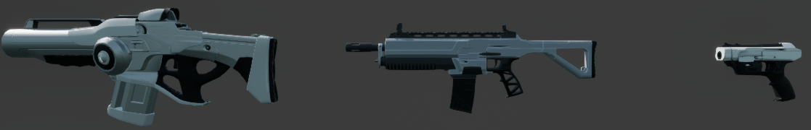
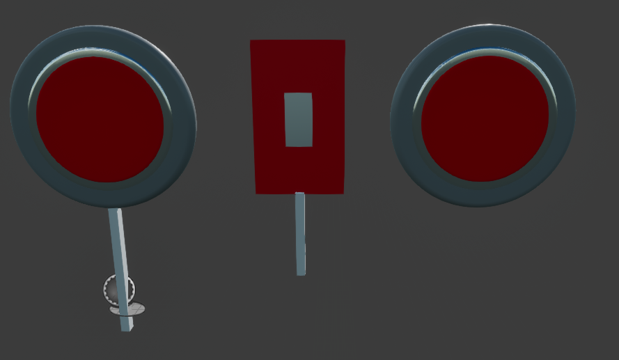
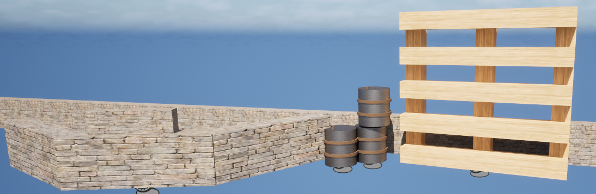
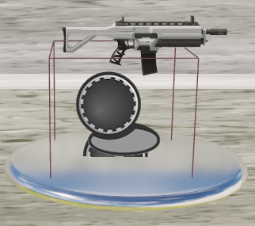
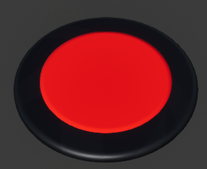
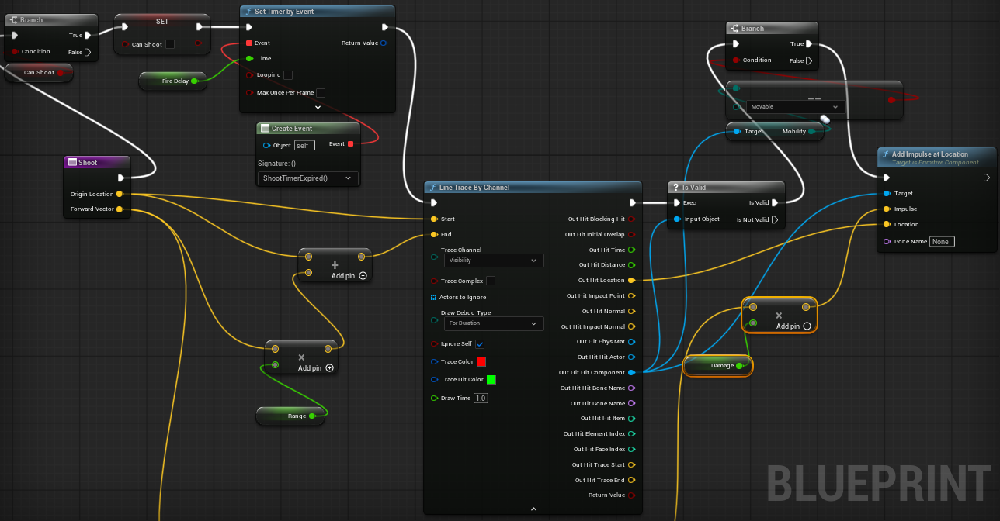
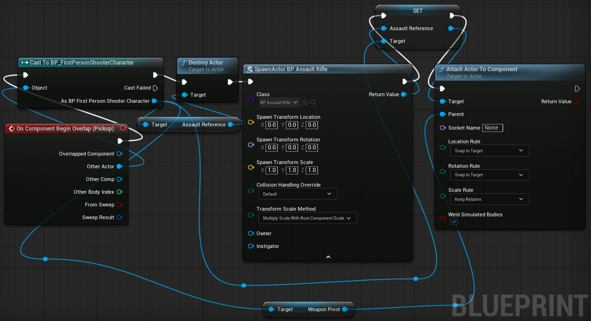
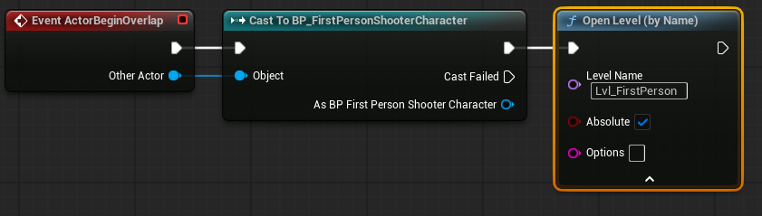

# Shooting Range
Placeholder Text

# Concept Image

Heavily inspired by an assignment given to me

## Intention
* Give the player a targets to shoot
* Display weapons that can be collected
* Include obstacles to impede the player

### Deisgn
A relatively simple map with good visibility.

### How to Win
Shoot all the targets. They will disappear when hit and not respawn until the game is reset.

### How to Lose
Run out of time. There is a 60 second timer.

## Objects
### Map

### Guns
---

#### Pistol
* Medium Fire Rate
* Low damage

#### Assault Rifle
* High Fire Rate
* Medium damage

#### Shotgun
* Low Fire Rate
* High damage
* Spread

### Targets
---

#### Stationary Target
* Spherical
* Does not move

#### Moving Target
* Square shaped
* Moves side to side

#### Floating Target
* Circular Shaped
* Floats in the sky
* Moves to several points

### Obstacles
---

#### Simple Wall
Waist high and can be jumped over. To show different sections of the level.

#### Basic Obstacle
To impede shots towards a moving target. Cannot be moved or damaged.

#### Beams
To partially conceal targets. Can be moved.

#### Barrel
Littered around the environment. Can be moved.

### Weapon Platform
* Silver
* On the ground
* Has weapons spinning above

### Reset Platform
* Black and red
* On the ground
* Will reset the game on contact

## Blueprints
### Guns
#### Assault Rifle
This is the parent class weapon and the shoot function is contained in this blueprint:

The gun icon blueprints contain the pickup and weapon swap logic, with each containing its own class weapon (BP_HandgunIcon has reference to BP_Handgun, etc.).

### Targets

### Reset Platform

This will quite simply reset the game when stepped on.

(Blueprints have been reordered for ease of screenshots)

## Challenges
* Timer
* Some targets may be difficult to spot

## Future Inclusions
* Additional weapons
* Ammunition counter
* Additional targets
* Animations for reloading, shooting etc.
* More varied targets
* 'Blinking' targets
* Hazards (spikes, lava etc.)

## Problems Encountered
* The targets were initially several different meshes laid on top of each other. These immedietely collapsed once physics were enabled, so I combined these all into a single mesh.
* Unreal engine kept 'forgetting' about changes I had made so some references to existing blueprints needed to be rebuilt occasionally.
* Moving targets using InterpToMovement could either not move or not have physics enabled.
* Guns would be picked up but there wasn't any changes in functionality at all. This was resolved by changing the "AssaultReference" boolean to public and referencing it in the icon blueprints.
* At one point during experimentation the blueprints had gotten so out of scope that I deemed it unrecoverable and abandoned it for an earlier build.
* The beams blueprint is supposed to allow impulses to pass through the empty spaces but this does not seem to be allowed.
* Spawning weapons somehow seemed to spawn them at the player start location, this was fixed by copying the spawn location blueprint from the player.